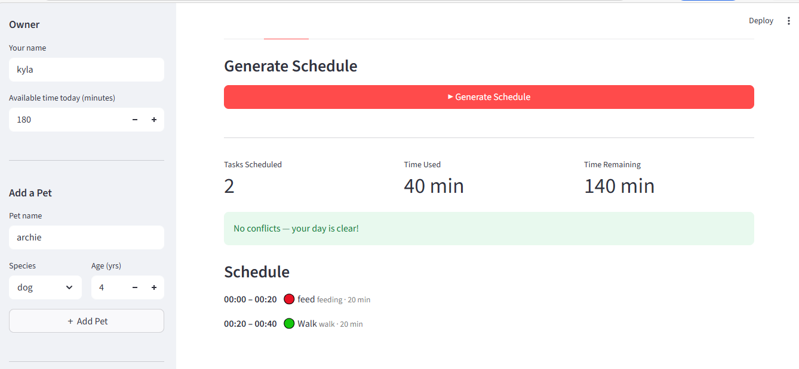

# PawPal+ (Module 2 Project)

You are building **PawPal+**, a Streamlit app that helps a pet owner plan care tasks for their pet.

## Implemented Features
- Sorting by priority and scheduled time
- Conflict detection + warning messages
- Recurring tasks with next-occurrence logic
- Complete recurring task carryover
- Input validation for tasks (title, type, duration, recurrence)
- Schedule filters (status/type)
- Streamlit display and UX with `st.table`, `st.success`, `st.warning`, and `st.info`

# Testing Pawpal+
python -m pytest

## Implemented features (testing checklist)
- Recurrence: month-end + leap-year next-occurrence math
- Priority sorting: high before low, stable tie path
- Complete recurring tasks: mark done + create next occurrence
- Validation: reject empty title/type, negative duration, zero recurrence
- Conflict detection: overlapping scheduled tasks flagged
- Schedule derived outcomes: planned duration, percent of availability

all tests are passes, confidence level 4.5 stars. May be room for error despite tests.

# Smarter Scheduling

- Multi-pet task planner
- Priority-aware daily schedule generation
- Recurring tasks: daily/weekly auto-refresh
- Conflict detection and warnings
- Sorting/filtering by time/pet/status
- Streamlit front-end & command-line demo
- Unit tests for core scheduling logic

## Scenario

A busy pet owner needs help staying consistent with pet care. They want an assistant that can:

- Track pet care tasks (walks, feeding, meds, enrichment, grooming, etc.)
- Consider constraints (time available, priority, owner preferences)
- Produce a daily plan and explain why it chose that plan

Your job is to design the system first (UML), then implement the logic in Python, then connect it to the Streamlit UI.

## What you will build

Your final app should:

- Let a user enter basic owner + pet info
- Let a user add/edit tasks (duration + priority at minimum)
- Generate a daily schedule/plan based on constraints and priorities
- Display the plan clearly (and ideally explain the reasoning)
- Include tests for the most important scheduling behaviors

## Getting started

### DEMO


 <a href="/course_images/ai110/app sc.png" target="_blank"></a>.

### Setup

```bash
python -m venv .venv
source .venv/bin/activate  # Windows: .venv\Scripts\activate
pip install -r requirements.txt
```

### Suggested workflow

1. Read the scenario carefully and identify requirements and edge cases.
2. Draft a UML diagram (classes, attributes, methods, relationships).
3. Convert UML into Python class stubs (no logic yet).
4. Implement scheduling logic in small increments.
5. Add tests to verify key behaviors.
6. Connect your logic to the Streamlit UI in `app.py`.
7. Refine UML so it matches what you actually built.
